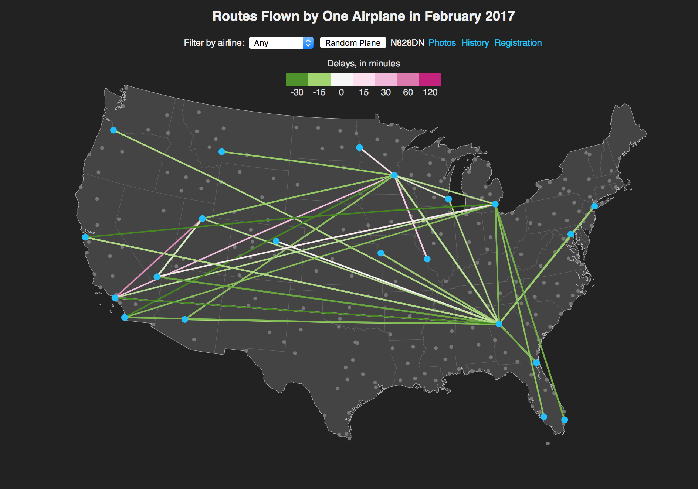

# Flights Visualization

This is an interactive map-based visualization of the domestic routes flown by every commercial aircraft in the U.S. and their on-time performance, presented one plane at a time. Originally written for my Data Visualization class (Carleton College CS314, Spring 2017), it makes use of the excellent [d3 library](https://d3js.org) and the Bureau of Transportation Statistics' [airline on-time performance dataset](https://www.bts.dot.gov/browse-statistical-products-and-data/bts-publications/airline-service-quality-performance-234-time).

## Installation

If you're interested in running this on your own computer, the first thing you'll have to do is download a copy of the latest on-time performance dataset:

	pip install requests beautifulsoup4 pandas
	python3 get-data.py

Now, start up a web server and navigate to [localhost:8000](http://localhost:8000) in your browser.

	php -S localhost:8000
